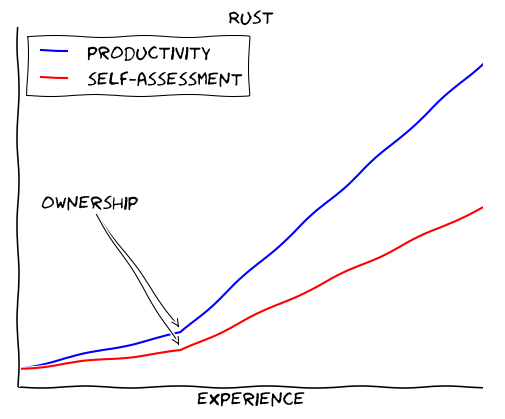

+++
title="Go vs Rust? Choose Go."
date=2017-09-15

[extra]
social_img="2017_gopher.png"
excerpt="""Rust or Go, which one should I choose? is a question I get quite often.
Both languages seem to be competing for the same user base and they both seem to be
*systems programming* languages, so there must be a clear winner, right?
"""
comments = [
  {name = "Hacker News", url = "https://news.ycombinator.com/item?id=15266066"},
  {name = "Reddit", url = "https://www.reddit.com/r/golang/comments/70iwcd/go_vs_rust_choose_go/"}]
+++

{{ figure(src="./hero.svg", credits="Gopher designed with [Gopherize.me](https://gopherize.me). Cogwheels designed by [Freepik](http://www.freepik.com/free-vector/gear-background-with-pieces-in-different-colors_966124.htm)") }}

"Rust or Go, which one should I choose?" is a question I get quite often.
Both languages seem to be competing for the same user base and they both seem to be
_systems programming_ languages, so there must be a clear winner, right?

**tl;dr**: _It's not so easy. Both languages have a different scope. Golang shines for writing microservices and for typical "DevOps" tasks, but it is not a systems programming language. Rust is stronger for tasks where concurrency, safety and/or performance are important; but it has a steeper learning curve than Go._

## Go: practical, pragmatic, plain


I don't think Go is an elegant language. Its biggest feature is simplicity.
Go is not even a systems programming language. While it's great for writing microservices and tooling around backend infrastructure, I would not want to write a kernel or a memory allocator with it.

But with Go, you _get things done_ &mdash; fast.  
Go is one of the most productive languages I've ever worked with.
The mantra is: solve real problems today.

## Rust's strong guarantees come at a cost



Rust in comparison is **hard**. It took me many months to become somewhat productive.
You need to invest a serious amount of time to see any benefit.
Rust is already a powerful language and it gets stronger every day.
It feels much more like a _pragmatic Haskell_ to me than a _safer C_.

Don't get me wrong: [I love Rust](https://www.youtube.com/channel/UCZ_EWaQZCZuGGfnuqUoHujw), and it helped me become a better programmer. It is certainly a nice language to learn. The big question is, if it is the right choice for your next major project.

Here's the thing: if you choose Rust, usually you need the guarantees, that the language provides:

- Safety against `Null` pointers, race conditions and all sorts of low-level threats.
- Predictable runtime behavior (zero cost abstractions and no garbage collector).
- (Almost) total control over the hardware (memory layout, processor features).
- Seamless interoperability with other languages.

If you don't _require_ any of these features, Rust might be a poor choice for your next project.
That's because these guarantees come with a cost: ramp-up time.
You'll need to unlearn bad habits and learn new concepts.
Chances are, you will [fight with the borrow checker](https://m-decoster.github.io/2017/01/16/fighting-borrowchk/) a lot when you start out.

## Case-study: Primality by trial division

Let's say, you want to check if a number is [prime](https://en.wikipedia.org/wiki/Prime_number).
The easiest way is to check if we can divide the number by any smaller natural number (without a remainder). If not, we found a prime number! This approach is called [trial division](https://en.wikipedia.org/wiki/Trial_division).

Here's how to do that in Golang (courtesy of [Rosetta Code](https://rosettacode.org/wiki/Primality_by_trial_division#Go)):

```go
func IsPrime(n int) bool {
	if n < 0 {
		n = -n
	}
	switch {
	case n < 2:
		return false
	default:
		for i := 2; i < n; i++ {
			if n%i == 0 {
				return false
			}
		}
	}
	return true
}
```

And here's the same thing in Rust:

```rust
pub fn is_prime(n: u64) -> bool {
    match n {
        0...1 => false,
        _ => {
            for d in 2..n {
                if n % d == 0 {
                    return false;
                }
            }
            true
        }
    }
}
```

At first sight, both solutions look pretty similar.
But if we look closer, we can spot some differences.

- In Go, we use a simple switch-case statement. In Rust, we use a [`match`](https://doc.rust-lang.org/1.2.0/book/match.html) statement, which is much more powerful.
- In Go, we use a simple for-loop to iterate over the numbers 2 to n. In Rust, we use a range expression (`2..n`).
- In Go, we use two `return` statements, in Rust we have one `return` _expression_. In general, most things in Rust are expressions, which can be returned and assigned to a variable. Read more about expressions [here](https://doc.rust-lang.org/beta/reference/expressions.html).

In many areas, Rust is more functional than Golang. You could rewrite the above code using the [`any`](https://doc.rust-lang.org/std/iter/trait.Iterator.html#method.any) method, which is implemented for `Range`.

```rust
fn is_prime(n: u64) -> bool {
    match n {
        0...1 => false,
        _ => !(2..n).any(|d| n % d == 0),
    }
}
```

It might seem a little alien at first, but it will become second-nature after a while.

This was just a quick example, of course. I suggest, you browse some code on [Rosetta Code](http://rosettacode.org/) to get a better feeling for both languages.

## Case study: Finding duplicate words in text files

If you're more like a visual type, here is a video where I write a simple
concurrent program in Go and Rust to compare both languages:

{{ video(id="B5xYBrxVSiE", preview="preview.jpg") }}

## Some things I prefer in Go

- Fast compile times
- Pragmatic problem-solving approach
- Nice ecosystem for typical _DevOps_ tasks
- Batteries-included standard-library
- IDE support
- Simple error handling
- The mascot 😉

## Some things I prefer in Rust

- Safety: No null pointers, no data races,...
- Fine-grained system control
- Incredible runtime speed (comparable with C/C++)
- Zero-cost abstractions
- Awesome, open-minded community
- Simple package management with cargo
- Support for Generics in form of traits
- C interop and FFI

## Conclusion

99% of the time, Go is "good enough" and that 1% where it isn't, you'll know.
And then take a look at Rust, because the two languages complement each other pretty well.

After all is said and done, [Rust and Go are not really competitors](https://dave.cheney.net/2015/07/02/why-go-and-rust-are-not-competitors).
