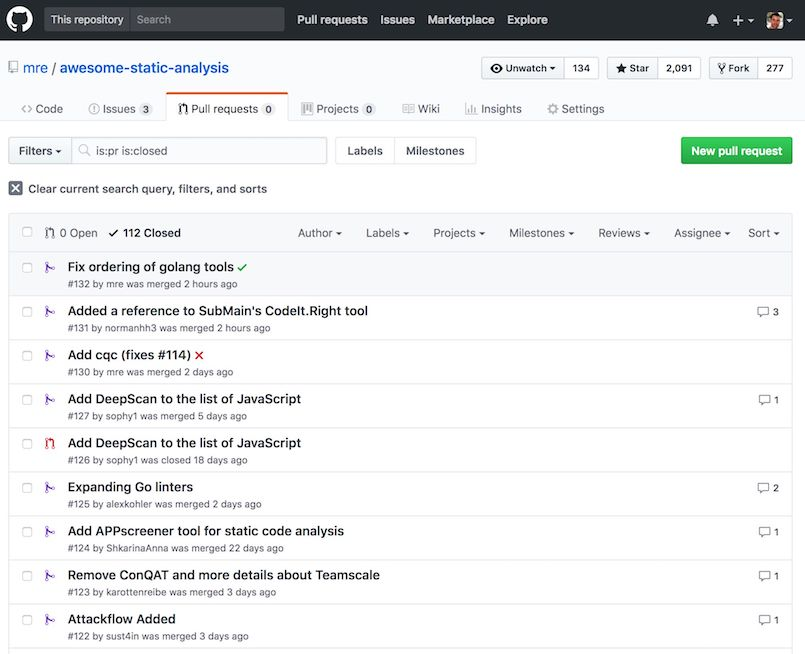

+++
title="Making Myself Obsolete"
date=2017-12-10

[extra]
subtitle="Writing a Linter for Linting Linters"
excerpt="In December 2015 I was looking for static analysis tools to integrate into trivago's CI process. The idea was to detect typical programming mistakes automatically. That's quite a common thing, and there are lots of helpful tools out there which fit the bill. So I looked for a list of tools..."
social_img="2017_obsolete.png"
+++

{{ figure(src="./dinosaur.svg", caption="The Stegosaurus had better days 150 million years ago.", credits="Paleontologists once thought it had a [brain in its butt](https://en.wikipedia.org/wiki/Stegosaurus#.22Second_brain.22).")}} 

In December 2015 I was looking for static analysis tools to integrate into [trivago](https://tech.trivago.com/)'s CI process.
The idea was to detect typical programming mistakes automatically.
That's quite a common thing, and there are lots of helpful tools out there which fit the bill.

So I looked for a list of tools...

To my surprise, [the only list I found was on Wikipedia](https://en.wikipedia.org/wiki/List_of_tools_for_static_code_analysis) &mdash; and it was outdated.
There was no such project on Github, where most modern static analysis tools were hosted.

Without overthinking it, I opened up my editor and wrote down a few tools I found through my initial research. After that, I pushed the list to Github.  

I called the project [Awesome Static Analysis](https://github.com/mre/awesome-static-analysis/).

Fast forward two years and the list has grown quite a bit.
So far, it has 75 contributors, 277 forks and received over 2000 stars. (Thanks for all the support!)
(Update May 2018: 91 contributors, 363 forks, over 3000 stars)

Around 1000 unique visitors find the list every week. Not much by any means, but I feel obliged to keep it up-to-date
because it has become an essential source of information for many people.

It now lists around 300 tools for static analysis. Everything from Ada to TypeScript is on there.
What I find particularly motivating is, that now the authors themselves create pull requests to add their tools!

There was one problem though: The list of pull requests got longer and longer, as I was busy doing other things.



## Adding contributors

I always try to make team members out of regular contributors. My friend and colleague [Andy Grunwald](https://github.com/andygrunwald) as well as [Ouroboros Chrysopoeia](https://github.com/impredicative) are both valuable collaborators. They help me weed out new PRs whenever they find the time.

But let's face it: checking the pull requests is a dull, manual task.
What needs to be checked for each new tool can be summarized like this:

* Formatting rules are satisfied
* Project URL is reachable
* License annotation is correct
* Tools of each section are alphabetically ordered
* Description is not too long

I guess it's obvious what we should do with that checklist: automate it!

## A linter for linting linters

So why not write an analysis tool, which checks our list of analysis tools!
What sounds pretty meta, is actually pretty straightforward.

With every pull request, we trigger our bot, which checks the above rules and responds with a result.

The first step was to read the [Github documentation about building a CI server](https://developer.github.com/v3/guides/building-a-ci-server/).

Just for fun, I wanted to create the bot in [Rust](https://www.rust-lang.org/).
The two most popular Github clients for Rust were [github-rs](https://github.com/mgattozzi/github-rs) and [hubcaps](https://github.com/softprops/hubcaps).
Both looked pretty neat, but then I found [afterparty](https://github.com/softprops/afterparty), a "Github webhook server".

The example looked fabulous:

```rust
#[macro_use]
extern crate log;
extern crate env_logger;
extern crate afterparty;
extern crate hyper;

use afterparty::{Delivery, Hub};

use hyper::Server;

pub fn main() {
    env_logger::init().unwrap();
    let addr = format!("0.0.0.0:{}", 4567);
    let mut hub = Hub::new();
    hub.handle("pull_request", |delivery: &Delivery| {
        match delivery.payload {
            Event::PullRequest { ref action, ref sender, .. } => {
                // TODO: My code here!
                println!("sender {} action {}", sender.login, action)
            }
            _ => (),
        }
    });
    let srvc = Server::http(&addr[..])
                   .unwrap()
                   .handle(hub);
    println!("listening on {}", addr);
    srvc.unwrap();
}
```

This allowed me to focus on the actual analysis code,
which makes for a pretty boring read. It mechanically checks for the things mentioned above and could be written in any language.
If you want to have a look (or even contribute!), [check out the repo](https://github.com/mre/awesome-static-analysis-ci).

## Talking to Github

After the analysis code was done, I had a bot, running locally, waiting for incoming pull requests.

But how could I talk to Github?  
I found out, that I should use the [Status API](https://developer.github.com/v3/repos/statuses/)
and send a `POST` request to `/repos/mre/awesome-static-analysis/statuses/:sha`  
(`:sha` is the commit ID that points to the `HEAD` of the pull request):

```
{
  "state": "success",
  "description": "The build succeeded!"
}
```

I could have used one of the existing Rust Github clients, but I decided to write a simple function to update the pull request status code.


```rust
fn set_status(status: Status, desc: String, repo: &str, sha: &str) -> Result<reqwest::Response> {
    let token = env::var("GITHUB_TOKEN")?;
    let client = reqwest::Client::new();
    let mut params = HashMap::new();
    params.insert("state", format!("{}", status));
    params.insert("description", desc);
    println!("Sending status: {:#?}", params);

    let status_url = format!("https://api.github.com/repos/{}/statuses/{}", repo, sha);
    println!("Status url: {}", status_url);
    Ok(client
        .request(
            reqwest::Method::Post,
            &format!(
                "{}?access_token={}",
                status_url,
                token,
            ),
        )
        .json(&params)
        .send()?)
}
```

You can see that I pass in a Github token from the environment and then I send the `JSON` payload as a post request using the [reqwest](https://github.com/seanmonstar/reqwest) library.

That turned out to become a problem in the end: while afterparty was using version 0.9 of [hyper](https://github.com/hyperium/hyper), reqwest was using 0.11. Unfortunately, these two versions depend on a different build of the [openssl-sys](https://crates.io/crates/openssl-sys) bindings. That's a [well-known problem](https://github.com/rust-lang/cargo/issues/886) and the only way to fix it, is to resolve the conflict.

I was stuck for a while, but then I saw, that there was an open pull request to [upgrade afterparty to hyper 0.10](https://github.com/softprops/afterparty/pull/26).

So inside my `Cargo.toml`, I locked the version of afterparty to the version of the pull request:

```toml
[dependencies]
afterparty = { git = "https://github.com/ms705/afterparty" }
```

This fixed the build, and I could finally move on.

## Deployment

I needed a place to host the bot.

Preferably for free, as it was a non-profit Open Source project.
Also, the provider would have to run binaries.

For quite some time, I was following a product named [zeit](https://zeit.co/).
It runs any Docker container using an intuitive command line interface called `now`.

<video controls>
  <source src="./now.mp4" type="video/mp4">
Your browser does not support playing mp4 files.
</video> 

I fell in love the first time I saw their demo on the site, so I wanted to give it a try.

So I added a [multi-stage Dockerfile](https://docs.docker.com/engine/userguide/eng-image/multistage-build/) to my project:

```dockerfile
FROM rust as builder
COPY . /usr/src/app 
WORKDIR /usr/src/app 
RUN cargo build --release

FROM debian:stretch
RUN apt update \
    && apt install -y libssl1.1 ca-certificates \
    && apt clean -y \
    && apt autoclean -y \
    && apt autoremove -y
COPY --from=builder target/release/check .
EXPOSE 4567
ENTRYPOINT ["./check"]
CMD ["--help"]
```

The first part would build a static binary, the second part would run it at container startup.
Well, that didn't work, because `zeit` [does not support multi-stage builds yet](https://github.com/zeit/now-cli/issues/962).

The workaround was to split up the Dockerfile into two and [connect them both with a Makefile](https://github.com/mre/awesome-static-analysis-ci/blob/master/Makefile). Makefiles are pretty powerful, [you know](./2017/makefiles/index.md)?

With that, I had all the parts for deployment together.


```
# Build Rust binary for Linux
docker run --rm -v $(CURDIR):/usr/src/ci -w /usr/src/ci rust cargo build --release

# Deploy Docker images built from the local Dockerfile
now deploy --force --public -e GITHUB_TOKEN=${GITHUB_TOKEN}

# Set domain name of new build to `check.now.sh`
# (The deployment URL was copied to the clipboard and is retrieved with pbpaste on macOS)
now alias `pbpaste` check.now.sh
```

Here's the output of the deploy using `now`:

```
> Deploying ~/Code/private/awesome-static-analysis-ci/deploy
> Ready! https://deploy-sjbiykfvtx.now.sh (copied to clipboard) [2s]
> Initializing…
> Initializing…
> Building
> ▲ docker build
Sending build context to Docker daemon 2.048 kBkB
> Step 1 : FROM mre0/ci:latest
> latest: Pulling from mre0/ci
> ...
> Digest: sha256:5ad07c12184755b84ca1b587e91b97c30f7d547e76628645a2c23dc1d9d3fd4b
> Status: Downloaded newer image for mre0/ci:latest
>  ---> 8ee1b20de28b
> Successfully built 8ee1b20de28b
> ▲ Storing image
> ▲ Deploying image
> ▲ Container started
> listening on 0.0.0.0:4567
> Deployment complete!
```

The last step was to add `check.now.sh` as a webhook inside the awesome-static-analysis [project settings](https://developer.github.com/webhooks/creating/).

Now, whenever a new pull request is coming in, you see that little bot getting active!


## Outcome and future plans

I am very pleased with my choice of tools: afterparty saved me from a lot of manual work, while zeit made deployment really easy.  
It feels like [Amazon Lambda](https://aws.amazon.com/lambda/details/) on steroids.

If you look at the [code](https://github.com/mre/awesome-static-analysis-ci/blob/master/src/main.rs) and the [commits](https://github.com/mre/awesome-static-analysis-ci/commits/master) for my bot, you can see all my little missteps, until I got everything just right. Turns out, parsing human-readable text is tedious.  
Therefore I was thinking about turning the list of analysis tools into a structured format like `YAML`. This would greatly simplify the parsing and have the added benefit of having a machine-readable list of tools that can be used for other projects.

## Update May 2018

While attending the [WeAreDevelopers conference in Vienna](http://wearedevelopers.com/) (can recommend that), I moved the CI pipeline from [zeit.co](http://zeit.co/) to [Travis CI](http://travis-ci.org/).
The reason was, that I wanted the linting code next to the project, which greatly simplified things.
First and foremost I don't need the web request handling code anymore, because travis takes care of that.
If you like, you can compare the [old](https://github.com/mre/awesome-static-analysis-ci/blob/master/src/main.rs) and the [new](https://github.com/mre/awesome-static-analysis/blob/master/ci/src/lib.rs) version.