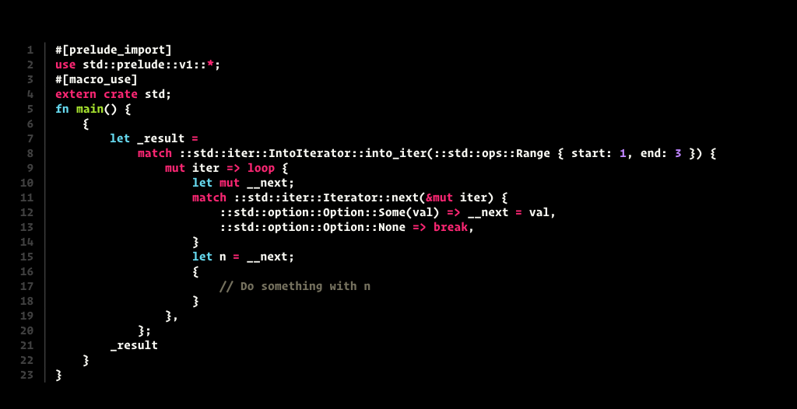

+++
title="What Is Rust Doing Behind the Curtains?"
date=2018-12-02

[extra]
subtitle="Find out with cargo-inspect!"
+++


Rust allows for a lot of syntactic sugar, that makes it a pleasure to write. It is sometimes hard, however, to look behind the curtain and see what the compiler is really doing with our code.

<!-- more -->

At [Rust Belt Rust 2018](https://www.rust-belt-rust.com), I saw a talk by Tshepang Lekhonkhobe titled *Syntax conveniences afforded by the compiler* ([Recording here](https://www.youtube.com/watch?v=Xk5IZOtLUmE)).

To quote the abstract:

> The Rust compiler provides a number of conveniences that make life easier for its users. It is good to know what these are, to avoid being mystified by what's going on under the hood... the less magical thinking we have of the world, the better.

He goes on to give a few examples of these conveniences:

* lifetime elisions
* type inference
* syntactic sugar
* implicit dereferencing
* type coercions
* hidden code (e.g. the [prelude](https://doc.rust-lang.org/std/prelude/index.html))

It was very educational and fun to see him compare code with and without these conveniences during the talk.

Coming home, I wanted to learn more. I wondered if there was a tool, which revealed what Rust was doing behind the curtains.

Over on Reddit, I found [a discussion about compiler flags to produce desugared output](https://www.reddit.com/r/rust/comments/6y9sut/is_there_any_way_to_for_learning_purposes_switch/).
(Note that I'm using [rustup](https://rustup.rs/) here to trigger the nightly compiler with the `+nightly` flag.)

```
rustc +nightly -Zunpretty=hir example.rs
```

`HIR` stands for high-level intermediate representation. This is basically an [abstract syntax tree (AST)](https://en.wikipedia.org/wiki/Abstract_syntax_tree) more suited for use by the compiler. It replaces syntactic sugar with basic building blocks that are easier to handle by the following compile steps.
To find out more, read this [detailed write-up by Nico Matsakis](https://github.com/rust-lang/rfcs/blob/master/text/1191-hir.md).


Anyway, the output looked surprisingly readable (see below). With some syntax highlighting and formatting, this could be quite a handy tool.

I tried to use [`rustfmt`](https://github.com/rust-lang/rustfmt) on it, and it worked unreasonably well.
Motivated by this quick win, I wrapped it up in a cargo subcommand and called it [`cargo-inspect`](https://github.com/mre/cargo-inspect).

Let's try cargo-inspect on some real code!

## Example - Desugaring a range expression

The following examples can also be found in the project's [`examples`](https://github.com/mre/cargo-inspect/tree/master/examples) folder.

*Input:*

```rust
for n in 1..3 {
    println!("{}", n);
}
```

*Output of cargo-inspect:*



That's the neatly formatted terminal output. It sports line numbers and colors, thanks to [`prettyprint`](https://github.com/mre/prettyprint), which is a library on top of [`bat`](https://github.com/sharkdp/bat/). Maybe you can't read that, so here's the gist of it:

```rust
match ::std::iter::IntoIterator::into_iter(
        ::std::ops::Range { start: 1, end: 3 })
  mut iter => loop {
    // ...
  },
};
```

We can see that `1..3` gets converted into [`std::ops::Range { start: 1, end: 3 }`](https://doc.rust-lang.org/std/ops/struct.Range.html).
To the compiler backend, these are absolutely the same. So this holds:

```rust
assert_eq!((1..3), std::ops::Range { start: 1, end: 3 });
```

## Example - File handling

*Input:*

```rust
use std::fs::File;
use std::io::Error;

fn main() -> Result<(), Error> {
    let file = File::open("file.txt")?;
    Ok(())
}
```

*Output:*

```rust
#[prelude_import]
use std::prelude::v1::*;
#[macro_use]
extern crate std;
use std::fs::File;
use std::io::Error;

fn main() -> Result<(), Error> {
  let file = match ::std::ops::Try::into_result(
      <File>::open("file.txt")) {
    ::std::result::Result::Err(err) =>
    #[allow(unreachable_code)]
    {
      #[allow(unreachable_code)]
      return ::std::ops::Try::from_error(
          ::std::convert::From::from(err))
    }
    ::std::result::Result::Ok(val) =>
    #[allow(unreachable_code)]
    {
      #[allow(unreachable_code)]
      val
    }
  };
  Ok(())
}
```

We can see that the carrier operator `?` gets desugared into a `match` on the `Result` of `File::open`. In case of an error, We apply `std::convert::From::from` to convert between error types. Otherwise, we simply return the `Ok` value.

## Talk

Over at [FOSDEM](fosdem.org/) in Belgium, I was able to speak about the project in detail.
Here is the recording:

{{ video(id="ePiWBGh35q0", preview="/talks/2019-fosdem.jpg") }}

## Future work

I'm not planning to rewrite the compiler here. `rustc` is doing a far greater job than I could. All this functionality already existed before; I'm merely trying to make the compiler more approachable for learners like me.

Right now, the tool is quite fragile. It throws ugly error messages when things go wrong.
It mostly shines, when you run it on small, isolated example snippets. 

## Get involved!

Over on Github, I opened up a few issues for others to get involved.
Namely, I wish there were options to:

* ✅ [Make it work with cargo projects.](https://github.com/mre/cargo-inspect/issues/2)
* ✅ [Show the original code above the desugared code.](https://github.com/mre/cargo-inspect/issues/5)
* [Show only part of the full output](https://github.com/mre/cargo-inspect/issues/10)  
* ...and [much more](https://github.com/mre/cargo-inspect/issues).

Also, if you find a particularly exciting code example, don't be shy to contribute it to the examples folder.
