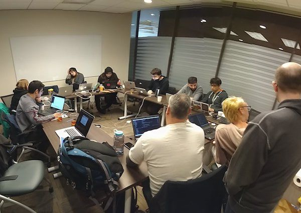

+++
title="Rust in 2018"
date=2018-01-09
updated=2022-01-02
[taxonomies]
tags=["dev", "rust"]

[extra]
subtitle="Streamline Collaboration and Empower Intermediate Users"
social_img="2018_rust_2018.jpeg"
+++

I wrote about the [future of Rust](@/2017/future-of-rust/index.md) before and it seems like nobody stops me from doing it again! Quite the contrary: this time the Rust core team even [asked for it](https://blog.rust-lang.org/2018/01/03/new-years-rust-a-call-for-community-blogposts.html).
I'm a bit late to the party, but here are my 2 cents about the priorities for Rust in 2018.

<!-- more -->

## Who _is_ this guy?

There's a depressingly high chance that we've never met before &mdash; which is a real shame.
For some context: I come from dynamically typed languages like Python and PHP.
Rust was the first language that allowed me to write _real_ low-level code without feeling like [arguing with a bouncer](https://www.youtube.com/watch?v=5uurT7yVWkQ).

To me, Rust is not a [fireflower](https://brson.github.io/fireflowers/), it's my own personal [Megazord](https://en.wikipedia.org/wiki/Power_Rangers)<a href="#fn1" id="ref1">1</a>.
I want Rust to win, but for that, we need to tick a few points off the list.

## Compiler documentation for easier contribution

When I was in Columbus, Ohio for [Rust Belt Rust](https://www.rust-belt-rust.com/), I met [Niko Matsakis](https://twitter.com/nikomatsakis), [Ariel Ben-Yehuda](https://github.com/arielb1), and [Santiago Pastorino](https://twitter.com/spastorino).
Those fine gentlemen eagerly worked on [non-lexical lifetimes](https://github.com/rust-lang/rust/pull/45538) during the impl-period.
Watching them hack away on the compiler was deeply inspirational to me, and I started wondering if I could contribute, too.
Needless to say, the barrier to entry for hacking on the compiler can be quite high.
I didn't contribute anything yet.

One thing I'd love to do is to spend short 30-60 minute chunks of time to fix a small thing in the compiler here and there. Could be as simple as renaming a variable, writing a test or adding some documentation.
Hence my first wish is, that contributing to the language will become easier.
That could be achieved by providing extensive mentorship, more entry-level tickets, and [better compiler documentation](https://internals.rust-lang.org/t/so-you-want-to-hack-on-the-rust-compiler-a-plan-for-a-book/6497).
All of that was already [suggested by Niko](https://smallcultfollowing.com/babysteps/blog/2018/01/05/lessons-from-the-impl-period/).

## More resources for intermediate programmers

On a related note, I'd like to see more talks/guidelines/books targeting intermediate Rust programmers.
This includes discussions on how to structure [big projects](https://github.com/servo/servo) in Rust and Rust-specific [design patterns](https://github.com/rust-unofficial/patterns).
I want to read more about professional Rust usage and see case-studies from various industries.
For example, there was a startup called snips.ai, which built an on-device voice-assistant using Rust.
They integrated with C and C++ libraries and [I want to hear more about their journey](https://medium.com/snips-ai/snips-big-wish-for-rust2018-libraries-or-portability-pick-two-814d104586d9).

## Improve the RFC process

I try to follow the RFC process very closely, but my time is limited.
My wish is, that I can open any RFC and immediately get its status:

- A summary of the discussion with major pros and cons.
- A simple usage example, right at the beginning.
- The next steps towards stabilization.

For example, if I look at [this](https://github.com/rust-lang/rfcs/issues/323) (not so) random issue, I don't even know where to start. What are the biggest blockers right now? Who is actively pushing this forward? How can I help out?

Github is great for code, but conversations about new features regularly get out of hand.
This is not a problem, that is limited to Rust, either. Just look at other big projects like Docker, Kubernetes, or Node.
Maybe we need a new tool for that.

## The usual suspects

If I could ask for two stable features in 2018, it would be [`?` in main](https://github.com/rust-lang/rust/issues/43301)
and [non-lexical lifetimes](https://github.com/rust-lang/rust/issues/44928).

There's more I could mention of course, but I'm not gonna bore you with [faster compile times](https://blog.rust-lang.org/2016/09/08/incremental.html), [impl trait](https://github.com/rust-lang/rust/issues/34511), [generators](https://doc.rust-lang.org/1.22.0/std/ops/trait.Generator.html), and the like.
We're on a good way here, see [Nick Cameron's post](https://www.ncameron.org/blog/rust-2018/) instead.

I'm convinced, that by improving documentation and mentorship, we can grow the number of contributors significantly
and stabilize many highly-anticipated features this year.

1. Disclaimer: I never watched a single episode of Power Rangers.<a href="#ref1" title="Jump back to footnote 1 in the text.">↩</a>
