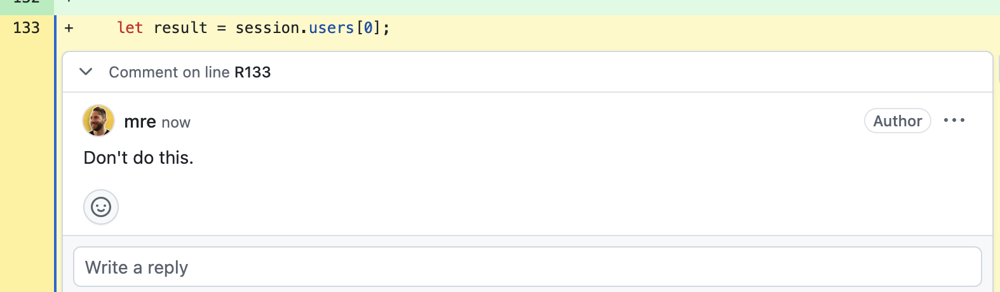
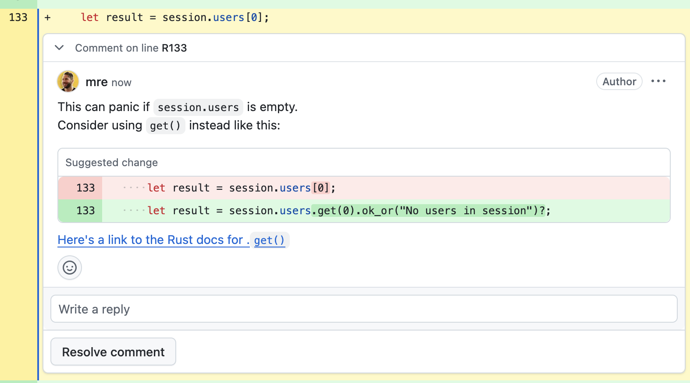

+++
title="How To Review Code"
date=2025-08-06
draft=false
[taxonomies]
tags=["dev", "culture"]
[extra]
credits = [
  {name = "Simon Brüggen", url="https://github.com/m3t0r" },
]
+++

I've been reviewing other people's code for a while now, more than two decades to be precise. 
Nowadays, I spend around 50-70% of my time reviewing code in some form or another.
It's what I get paid to do, alongside systems design.

Over time, I learned a thing or two about how to review code effectively.
I focus on different things now than when I started.

## Think About The Big Picture

Bad reviews are narrow in scope.
They focus on syntax, style, and minor issues instead of maintainability and extensibility. 

Good reviews look at not only the changes, but also what problems the changes solve, what future issues might arise, and how a change fits into the overall design of the system.

I like to look at the lines that *weren't* changed. They often tell the true story.

For example, often people forget to update a related section of the codebase or the docs.
This can lead to bugs, confusion, breaking changes, or security issues. 

Be thorough and look at all call-sites of the new code.
Have they been correctly updated?
Are the tests still testing the right thing?
Are the changes in the right place?



Here's a cheat sheet of questions I ask myself when reviewing code:
- How does this code fit into the rest of the system?
- What's its interaction with other parts of the codebase?
- How does it affect the overall architecture?
- Does it impact future planned work?



These questions have more to do with systems design than with the changes themselves.
Don't neglect the bigger picture because systems become brittle if you accept bad changes.

Code isn't written in isolation.
The role of more experienced developers is to reduce operational friction and handle risk management for the project.
The documentation, the tests, and the data types are equally as important as the code itself. 

Always keep an eye out for better abstractions as the code evolves.

## Naming Is Everything

I spend a big chunk of my time thinking about good names when reviewing code.

Naming things is hard, which is why it's so important to get it right. 
Often, it's the most important part of a code review.

It's also the most subjective part, which makes it tedious because it's hard to distinguish between nitpicking and important naming decisions.

Names encapsulate concepts and serve as "building blocks" in your code.
Bad names are the code smell that hint at problems running deep. 
They increase cognitive overhead by one or more orders of magnitude. 

For example, say we have a struct that represents a player's stats in a game:

```rust
struct Player {
    username: String,
    score: i32,
    level: i32,
}
```

I often see code like this:

```rust
// Bad: using temporary/arbitrary names creates confusion
fn update_player_stats(player: Player, bonus_points: i32, level_up: bool) -> Player {
    let usr = player.username.trim().to_lowercase();
    let updated_score = player.score + bonus_points;
    let l = if level_up { player.level + 1 } else { player.level };
    let l2 = if l > 100 { 100 } else { l };
    
    Player {
        username: usr,
        score: updated_score, 
        level: l2,
    }
}
```

This code is hard to read and understand.
What is `usr`, `updated_score`, and `l2`? The purpose is not conveyed clearly. 
This builds up cognitive load and make it harder to follow the logic.

That's why I always think of the most fitting names for variables, even if it feels like I'm being pedantic. 

```rust
// Good: meaningful names that describe the transformation at each step
fn update_player_stats(player: Player, bonus_points: i32, level_up: bool) -> Player {
    // Each variable name describes what the value represents
    let username = player.username.trim().to_lowercase();
    let score = player.score + bonus_points;

    // Use shadowed variables to clarify intent
    let level = if level_up { player.level + 1 } else { player.level };
    let level = if level > 100 { 100 } else { level };
    
    // If done correctly, the final variable names
    // often match the struct's field names
    Player {
        username,
        score,
        level,
    }
}
```

Good names become even more critical in larger codebases where values are declared far away from where they're used 
and where many developers have to have a shared understanding of the problem domain.

## Don't Be Afraid To Say "No"

I have to decline changes all the time and it's never easy.
After all someone put in a lot of effort and they want to see their work accepted.

Avoid sugarcoating your decision or trying to be nice.
Be objective, explain your reasoning and provide better alternatives.
Don't dwell on it, but focus on the next steps.

It's better to say no than to accept something that isn't right and will cause problems down the road. 
In the future it will get even harder to deny a change once you've set a precedent.

That's the purpose of the review process: there is no guarantee that the code will be accepted. 

In open source, many people will contribute code that doesn't meet your standards.
There needs to be someone who says "no" and this is a very unpopular job (ask any open source maintainer). 
However, great projects need gatekeepers because the alternative is subpar code and eventually unmaintainable projects. 

At times, people will say "let's just merge this and fix it later."
I think that's a slippery slope.
It can lead to tech debt and additional work later on.
It's hard to stand your ground, but it's important to do so.
If you see something that isn't right, speak up.

When it gets hard, remember that you're not rejecting the person, you're rejecting the code.
Remind people that you appreciate their effort and that you want to help them improve.

Even though you'll develop an intuition for what to focus on in reviews, you should still back it up with facts.
If you find yourself saying "no" to the same thing over and over again, consider writing a style guide or a set of guidelines for your team.

Be gracious but decisive; it's just code.


## Code Review Is Communication

Code reviews aren't just about code; people matter too.
Building a good relationship with your coworkers is important.

I make it a point to do the first couple of reviews together in a pair programming session if possible.

This way, you can learn from each other's communication style.
Building trust and getting to know each other works well this way.
You should repeat that process later if you notice a communication breakdown or misunderstanding.

## Use Multiple Iterations Of Reviews 

"Can you take a quick look at this PR? I want to merge it today."
There often is an expectation that code reviews are a one-time thing.
That's not how it works.
Instead, code reviews are an iterative process.
Multiple iterations should be expected to get the code right.

In my first iteration, I focus on the big picture and the overall design. 
Once I'm done with that, I go into the details.

The goal shouldn't be to merge as quickly as possible, but to accept code that is of high quality.
Otherwise, what's the point of a code review in the first place?
That's a mindset shift that's important to make.

Reviews aren't *exclusively* about pointing out flaws, they're also about creating a shared understanding of the code within the team.
I often learn the most about writing better code by reviewing other people's code.
I've also gotten excellent feedback on my own code from excellent engineers.

These are invaluable "aha moments" that help you grow as a developer.
Experts spent their valuable time reviewing *my* code, and I learned a lot from it.
I think everybody should experience that once in their career.

## Don't Be A Jerk

From time to time, you'll disagree with the author.
Being respectful and constructive is important.
Avoid personal attacks or condescending language.
Don't say "this is wrong."
Instead, say "I would do it this way."
If people are hesitant, ask a few questions to understand their reasoning. 

- "Will this break existing workflows if we do it this way?"
- "Which alternatives have you considered?"
- "What happens if you call this function with an empty array?"
- "If I don't set this value, what will be the error message presented to the user?"

These ["Socratic questions"](https://en.wikipedia.org/wiki/Socratic_questioning)[^lucca] help the author think about their decisions and can lead to better designs.

[^lucca]: Thanks for pointing out that term to me, Lucca!

People should enjoy receiving your feedback.
If not, revisit your review style.
Only add comments that you yourself would be happy to receive.

From time to time, I like to add positive comments like "I like this" or "this is a great idea."
Keeping the author motivated and showing that you appreciate their work goes a long way.

## If Possible, Try To Run The Code

It's easy to miss subtle details when you look at code for too long. 
Having a local copy of the code that I can play with helps me a lot.

I try to run the code, the tests, and the linters if I can. 
Checking out the branch, moving things around, breaking things, and trying to understand how it works is part of my review process.

User-facing changes like UI changes or error messages are often easier to spot when you run the code and try to break it.

After that, I revert the changes and, if needed, write down my findings in a comment.
Better understanding can come from this approach.

## Be Upfront About Your Availability 

Code reviews are often a bottleneck in the development process, because they can't be fully automated:
there's a human in the loop who has to look at the code and provide feedback.

But if you wait for your colleagues to review your code, that can lead to frustration.
Avoid being that person. 

Sometimes you won't have time to review code and that is okay.
If you can't review the code in a reasonable time, let the author know.

I'm still working on this, but I try to be more proactive about my availability and set clear expectations. 

## Never Stop Learning

Code reviews are my favorite way to learn new things.
I learn new techniques, patterns, new libraries, but most importantly, how other people approach problems. 

I try to learn one new thing with each review.
It's not wasted time, if it helps the team improve and grow as a whole.

## Don't Be Nitpicky

Formatters exist for a reason: leave whitespace and formatting to the tools.
Save your energy for issues that truly matter.

Focus on logic, design, maintainability, and correctness. Avoid subjective preferences that don't impact code quality.

Ask yourself: Does this affect functionality or would it confuse future developers? If not, let it go.

## Focus On The Why, Not The How

When reviewing code, focus on the reasoning behind the changes.
This has a much better chance of success than pointing out flaws without any reasoning. 

Consider the following two code review comments.
The first one is unhelpful and dismissive.



The second suggests an alternative, links to the documentation, and explains why the change could lead to problems down the road. 



Which one would you prefer to receive?

I realize that this requires more time and effort, but it's worth it!
Most of the time, the author will appreciate it and avoid making the same mistake in the future. There is a compound effect from helpful reviews over time.

## Don't Be Afraid To Ask Stupid Questions

Asking is better than assuming.
If you don't understand something, ask the author to explain it.
Chances are, you're not the only one who doesn't get it.

Often, the author will be happy to explain their reasoning.
Better understanding of the code and the system as a whole can result from this.
It can also help the author see things from a different perspective.
Perhaps they'll learn that their assumptions were wrong or that the system isn't self-explanatory.
Perhaps there's missing documentation?

[Asking great questions is a superpower.](/2024/asking-better-questions/)

## Ask For Feedback On Your Reviewing Style

From time to time, ask the author for feedback on your feedback: 

- Have you been too harsh/nitpicky/slow/sloppy?
- Did you point out the right things?
- Did your feedback help them?
- Do they have suggestions for improvement?

Basically, you ask them to review your review process, heh.

Learning how to review code is a skill that needs constant practice and refinement.
Good luck finding your own style.
