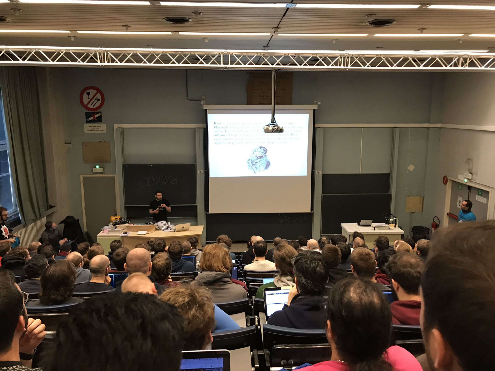
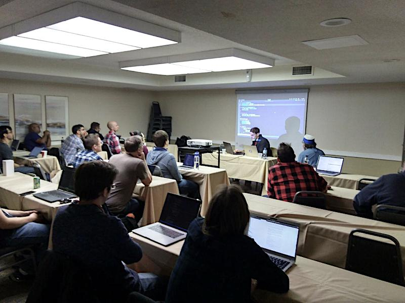
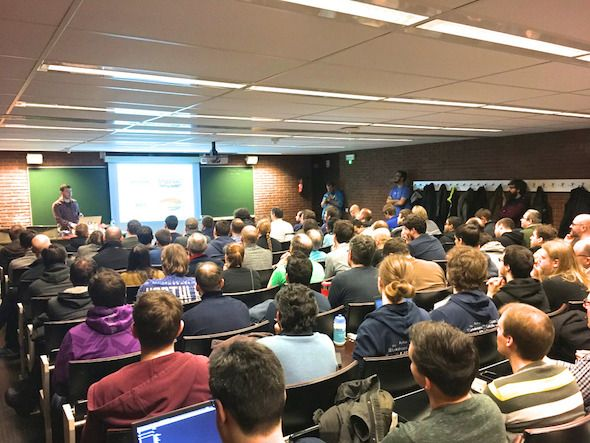
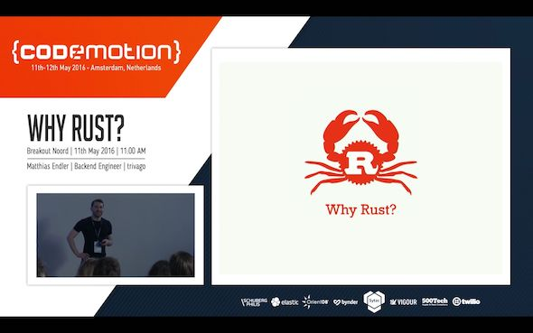
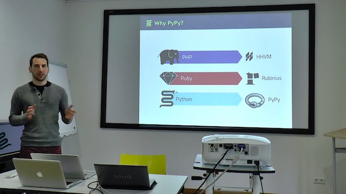

+++
title = "Talks"
path = "talks"
+++

Good talks are fun and educational. 
Here's a list of previous events where I spoke.
If you would like me to speak at your event, let's [get connected](mailto:matthias-endler@gmx.net)!

## What is Rust doing behind the curtains?

-   FOSDEM, February 2019
-   [Recording](https://fosdem.org/2019/schedule/event/rust_cargo_inspect/)
-   [Slides](https://speakerdeck.com/mre/what-is-rust-doing-behind-the-curtains)

Rust allows for a lot of syntactic sugar, that makes it a pleasure to write. It
is sometimes hard, however, to look behind the curtain and see what the compiler
is really doing with our code. "It is good to know what these conveniences are,
to avoid being mystified by what's going on under the hood... the less magical
thinking we have of the world, the better." (Tshepang Lekhonkhobe). In this
hands-on talk, we will go from code with a lot of syntactic sugar to extremely
verbose Rust code.

We will use a little tool called cargo-inspect, which was built for teaching
Rust internals. The goal is to make the compiler more approachable to mere
mortals.

## Workshop: Write Your Own Shell in Rust

-   RustBeltRust Ann Arbor, October 2018
-   In collaboration with [Santiago
    Pastorino](https://github.com/spastorino)
-   [Code](https://gitlab.com/mre_/rush)
-   [Slides](https://speakerdeck.com/mre/workshop-write-your-own-shell-in-rust)

One of the things developers use every day is a shell. It comes in many
flavors, like bash, fish or zsh. Depending on your background, writing
your own shell from scratch might either sound intimidating or
pointless. We like to believe that it can be a fun way to gain more
hands-on Rust experience. If you want to play with concepts like I/O,
error handling, and syscalls, we invite you to participate in this
workshop. Who knows, it could also be an opportunity to start your first
mid-size Rust project!

## Hyperjson — The Journey Towards Faster Safer JSON Parsing in Python Using Rust

-   Rust Cologne, August 2018
-   [Recording](https://www.youtube.com/watch?v=f1ln5j3aoSI)
-   [Slides](https://speakerdeck.com/mre/hyperjson-the-journey-towards-faster-safer-json-parsing-in-python-using-rust)

During a recent Python Hackathon in Düsseldorf, Matthias somehow managed
to sneak in some Rust code while writing a fast, safe Python module for
encoding and decoding JSON. It passes (most of) the Python test suite
for the json module and was unreasonably pleasant to write. Listen
carefully as he tells the story of a little side-project that got out of
hand and how Rust can help speed up even the most boring,
highly-optimized tasks like parsing file formats in the future.

## Idiomatic Rust — Writing Concise and Elegant Rust Code

-   FOSDEM, February 2018
-   [Recording](https://www.youtube.com/watch?v=P2mooqNMxMs)
-   [Slides](https://speakerdeck.com/mre/idiomatic-rust-writing-concise-and-elegant-rust-code)

Rust is a big language and it gets bigger every day. Many beginners ask:
"What is idiomatic Rust?". This talk will highlight simple tips to make
your Rust code more elegant and concise, and introduce you to my
peer-reviewed collection of articles/talks/repos for writing idiomatic
Rust code.

## Workshop: Live Coding Like No One's Watching!

-   Rust Belt Rust, October 2017

So, you’ve heard of this “Rust” last year. Still it feels a bit like
self-assembly furniture: you don’t know how all the parts fit together.
Watch me make a fool of myself by trying to solve some common
programming tasks in Rust.
Highlights: Nervous laughter, self-demeaning humor, browsing the Rust
documentation for clues. I might explain a little Rust along the way.

## My Good Friend Rust — an introduction

-   Topconf Düsseldorf, October 2017
-   [Slides](https://speakerdeck.com/mre/my-good-friend-rust-topconf-2017)

Rust is more than a Systems Programming language; it's a new way of
thinking about low-level code. It has strong safety and concurrency
guarantees without sacrificing performance. It provides powerful
abstractions that make Systems Programming both, easier and more fun.
Let me show you what's in for you and why you should learn Rust, even
though you might be a Web-Developer.

## What's So Hard About Writing a Slack Client in Rust?

-   Rust Usergroup Cologne, March 2017
-   [Recording](https://www.youtube.com/watch?v=rrtJh1kz1Ms)
-   [Slides](https://speakerdeck.com/mre/whats-so-hard-about-writing-a-slack-client-in-rust)

"I'll just write a simple API wrapper for that. Give me two hours." Does
that sound oddly familiar? Don't be fooled: writing an easy to use,
idiomatic abstraction layer is a lot of work - in any language. I want
to tell you my story about writing a Slack client in Rust. From
documentation to testing and error handling there's a lot of pitfalls to
avoid and laughs to share.

## Why Rust?

-   Codemotion Amsterdam, May 2016
-   [Recording](https://www.youtube.com/watch?v=imtejBNbm0o)
-   [Slides](https://speakerdeck.com/mre/why-rust)

Rust is the new kid on the block. It's a system programming language
that is blazingly fast and offers powerful high-level abstractions
better known from dynamic languages like Ruby or Python. Rust offers
memory safety without a Garbage Collector and makes low-level
programming easier and more secure. I will give an introductory talk
about Rust and show some of its nicest features.

## Rust Tooling

-   Rust Cologne Meetup, October 2015
-   [Slides](https://speakerdeck.com/mre/rust-tooling-october-2015)

What tools are available for Rust development? This talk gives you an
overview of ways to help you write better Rust code.

## The State of PyPy

-   Python Usergroup Düsseldorf, April 2015
-   [Recording](https://www.youtube.com/watch?v=YEzuUJGcPqc)
-   [Slides](https://speakerdeck.com/mre/the-state-of-pypy-april-2015)

PyPy is a relatively new implementation of Python with a focus on
performance. In this talk I give an overview of PyPy and how it works
internally. Also I talk a bit about PyPy STM, a new approach for
parallel code execution that can take advantage of modern multi-core
hardware.

You can find all my other talks on
[Speakerdeck](https://speakerdeck.com/mre).